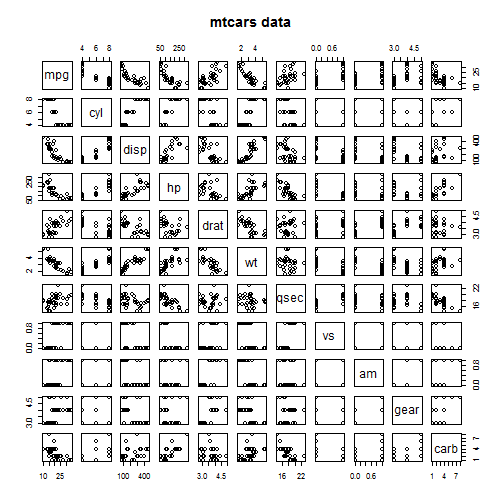
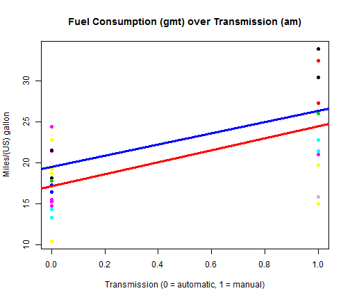

Vehicle Fuel Consumption
========================================================
## Executive Summary

In this issue of the "Motor Trend", we will explore the features that affect fuel consumption in miles per gallon (MPG). The main questions to be addressed are:

- “Is an automatic or manual transmission better for MPG”
- “Quantifying how different is the MPG between automatic and manual transmissions?”

It seems that fuel consumption is larger for manual transmission vehicles compared to automatic. 

## Input Data
The data to be used in this study are extracted from the 1974 Motor Trend US magazine, and comprises fuel consumption and 10 aspects of automobile design and performance for 32 automobiles (1973–74 models).

The data frame consists of 32 observations on 11 variables.

- **mpg**:	 Miles/(US) gallon
- **cyl**:	 Number of cylinders
- **disp**:	 Displacement (cu.in.)
- **hp**:	 Gross horsepower
- **drat**:	 Rear axle ratio
- **wt**:	 Weight (lb/1000)
- **qsec**:	 1/4 mile time
- **vs**:	 V/S
- **am**:	 Transmission (0 = automatic, 1 = manual)
- **gear**:	 Number of forward gears
- **carb**:	 Number of carburetors


```r
data(mtcars)
head(mtcars)
```

```
##                    mpg cyl disp  hp drat    wt  qsec vs am gear carb
## Mazda RX4         21.0   6  160 110 3.90 2.620 16.46  0  1    4    4
## Mazda RX4 Wag     21.0   6  160 110 3.90 2.875 17.02  0  1    4    4
## Datsun 710        22.8   4  108  93 3.85 2.320 18.61  1  1    4    1
## Hornet 4 Drive    21.4   6  258 110 3.08 3.215 19.44  1  0    3    1
## Hornet Sportabout 18.7   8  360 175 3.15 3.440 17.02  0  0    3    2
## Valiant           18.1   6  225 105 2.76 3.460 20.22  1  0    3    1
```


## Feature Selection

Initially we plot a matrix of scatter plots displaying how the variables affect each other.
Then we calculate which of the variables are strongly correlated with each other.

The most important features seem to be disp - Displacement (cu.in.) and cyl - Number of cylinders.

The feature under discussion, am - Transmission (0 = automatic, 1 = manual) seems not between those strongly affecting others. We will combine it with the features with which am is least correlated:
- carb
- vs
- qsec
- hp


```r
require(graphics)
pairs(mtcars, main = "mtcars data")
```

 

```r

M <- abs(cor(mtcars[, -1]))
diag(M) <- 0
which(M > 0.9, arr.ind = T)
```

```
##      row col
## disp   2   1
## cyl    1   2
```

```r
sort(M[8, -8])
```

```
##    carb      vs    qsec      hp     cyl    disp      wt    drat    gear 
## 0.05753 0.16835 0.22986 0.24320 0.52261 0.59123 0.69250 0.71271 0.79406
```


## Regression Models
am is a binary variable. 
After several repetitions (starting with all candidate covariants) it seems that regression with covariates carb and vs produced the best results (regarding variance and p-values).


```r
lm1 <- lm(mpg ~ am, mtcars)
lm2 <- lm(mpg ~ am + carb + vs, mtcars)
```


## Model Evalution
Residual standard error, p-values and standard and press residuals (for am and covariants) are displayed below:

```r
summary(lm1)
```

```
## 
## Call:
## lm(formula = mpg ~ am, data = mtcars)
## 
## Residuals:
##    Min     1Q Median     3Q    Max 
## -9.392 -3.092 -0.297  3.244  9.508 
## 
## Coefficients:
##             Estimate Std. Error t value Pr(>|t|)    
## (Intercept)    17.15       1.12   15.25  1.1e-15 ***
## am              7.24       1.76    4.11  0.00029 ***
## ---
## Signif. codes:  0 '***' 0.001 '**' 0.01 '*' 0.05 '.' 0.1 ' ' 1
## 
## Residual standard error: 4.9 on 30 degrees of freedom
## Multiple R-squared:  0.36,	Adjusted R-squared:  0.338 
## F-statistic: 16.9 on 1 and 30 DF,  p-value: 0.000285
```

```r
rstandard(lm1)
```

```
##           Mazda RX4       Mazda RX4 Wag          Datsun 710 
##            -0.72028            -0.72028            -0.33809 
##      Hornet 4 Drive   Hornet Sportabout             Valiant 
##             0.89130             0.32541             0.19966 
##          Duster 360           Merc 240D            Merc 230 
##            -0.59677             1.52006             1.18472 
##            Merc 280           Merc 280C          Merc 450SE 
##             0.43021             0.13678            -0.15664 
##          Merc 450SL         Merc 450SLC  Cadillac Fleetwood 
##             0.03199            -0.40814            -1.41416 
## Lincoln Continental   Chrysler Imperial            Fiat 128 
##            -1.41416            -0.51294             1.70025 
##         Honda Civic      Toyota Corolla       Toyota Corona 
##             1.27560             2.01874             0.91226 
##    Dodge Challenger         AMC Javelin          Camaro Z28 
##            -0.34527            -0.40814            -0.80636 
##    Pontiac Firebird           Fiat X1-9       Porsche 914-2 
##             0.43021             0.61738             0.34136 
##        Lotus Europa      Ford Pantera L        Ferrari Dino 
##             1.27560            -1.82438            -0.99630 
##       Maserati Bora          Volvo 142E 
##            -1.99424            -0.63535
```

```r
resid(lm1)/(1 - hatvalues(lm1))
```

```
##           Mazda RX4       Mazda RX4 Wag          Datsun 710 
##             -3.6750             -3.6750             -1.7250 
##      Hornet 4 Drive   Hornet Sportabout             Valiant 
##              4.4889              1.6389              1.0056 
##          Duster 360           Merc 240D            Merc 230 
##             -3.0056              7.6556              5.9667 
##            Merc 280           Merc 280C          Merc 450SE 
##              2.1667              0.6889             -0.7889 
##          Merc 450SL         Merc 450SLC  Cadillac Fleetwood 
##              0.1611             -2.0556             -7.1222 
## Lincoln Continental   Chrysler Imperial            Fiat 128 
##             -7.1222             -2.5833              8.6750 
##         Honda Civic      Toyota Corolla       Toyota Corona 
##              6.5083             10.3000              4.5944 
##    Dodge Challenger         AMC Javelin          Camaro Z28 
##             -1.7389             -2.0556             -4.0611 
##    Pontiac Firebird           Fiat X1-9       Porsche 914-2 
##              2.1667              3.1500              1.7417 
##        Lotus Europa      Ford Pantera L        Ferrari Dino 
##              6.5083             -9.3083             -5.0833 
##       Maserati Bora          Volvo 142E 
##            -10.1750             -3.2417
```

```r

summary(lm2)
```

```
## 
## Call:
## lm(formula = mpg ~ am + carb + vs, data = mtcars)
## 
## Residuals:
##    Min     1Q Median     3Q    Max 
## -6.280 -1.231  0.408  2.052  4.820 
## 
## Coefficients:
##             Estimate Std. Error t value Pr(>|t|)    
## (Intercept)   19.517      1.609   12.13  1.2e-12 ***
## am             6.798      1.101    6.17  1.2e-06 ***
## carb          -1.431      0.408   -3.51   0.0016 ** 
## vs             4.196      1.325    3.17   0.0037 ** 
## ---
## Signif. codes:  0 '***' 0.001 '**' 0.01 '*' 0.05 '.' 0.1 ' ' 1
## 
## Residual standard error: 2.96 on 28 degrees of freedom
## Multiple R-squared:  0.782,	Adjusted R-squared:  0.758 
## F-statistic: 33.4 on 3 and 28 DF,  p-value: 2.14e-09
```

```r
rstandard(lm2)
```

```
##           Mazda RX4       Mazda RX4 Wag          Datsun 710 
##            0.146331            0.146331           -2.267159 
##      Hornet 4 Drive   Hornet Sportabout             Valiant 
##           -0.315784            0.731453           -1.496817 
##          Duster 360           Merc 240D            Merc 230 
##            0.177655            1.269128            0.696874 
##            Merc 280           Merc 280C          Merc 450SE 
##            0.462716           -0.072659            0.412237 
##          Merc 450SL         Merc 450SLC  Cadillac Fleetwood 
##            0.728007           -0.008789           -1.192344 
## Lincoln Continental   Chrysler Imperial            Fiat 128 
##           -1.192344            0.318168            1.198392 
##         Honda Civic      Toyota Corolla       Toyota Corona 
##            0.981444            1.739884           -0.279995 
##    Dodge Challenger         AMC Javelin          Camaro Z28 
##           -0.413585           -0.520932           -0.173627 
##    Pontiac Firebird           Fiat X1-9       Porsche 914-2 
##            0.910365           -0.642682            0.953467 
##        Lotus Europa      Ford Pantera L        Ferrari Dino 
##            0.981444           -1.719689            0.740790 
##       Maserati Bora          Volvo 142E 
##            0.058333           -2.230000
```

```r
resid(lm2)/(1 - hatvalues(lm2))
```

```
##           Mazda RX4       Mazda RX4 Wag          Datsun 710 
##             0.46069             0.46069            -7.18033 
##      Hornet 4 Drive   Hornet Sportabout             Valiant 
##            -0.99152             2.29624            -4.69979 
##          Duster 360           Merc 240D            Merc 230 
##             0.54751             3.98232             2.18668 
##            Merc 280           Merc 280C          Merc 450SE 
##             1.55241            -0.24377             1.26893 
##          Merc 450SL         Merc 450SLC  Cadillac Fleetwood 
##             2.24091            -0.02705            -3.67467 
## Lincoln Continental   Chrysler Imperial            Fiat 128 
##            -3.67467             0.98056             3.79543 
##         Honda Civic      Toyota Corolla       Toyota Corona 
##             3.07245             5.51039            -0.87914 
##    Dodge Challenger         AMC Javelin          Camaro Z28 
##            -1.29836            -1.63536            -0.53510 
##    Pontiac Firebird           Fiat X1-9       Porsche 914-2 
##             2.85790            -2.03544             3.13241 
##        Lotus Europa      Ford Pantera L        Ferrari Dino 
##             3.07245            -5.41408             2.44473 
##       Maserati Bora          Volvo 142E 
##             0.22804            -6.98110
```


## Results
The following figure displays how fuel consumption varies with transmission. Fitted lines on am (red) and am+carb+vs (blue) are added. 


```r
plot(mtcars$mpg ~ mtcars$am, col = mtcars$hp, pch = 19, main = "Fuel Consumption (gmt) over Transmission (am)", 
    xlab = "Transmission (0 = automatic, 1 = manual)", ylab = "Miles/(US) gallon")
abline(lm1, lwd = 3, col = "red")
abline(lm2, lwd = 3, col = "blue")
```

```
## Warning: only using the first two of 4 regression coefficients
```

 

